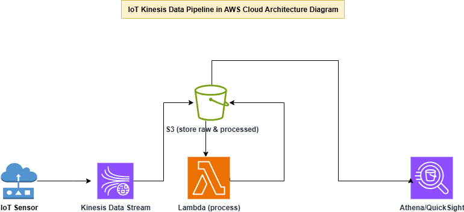
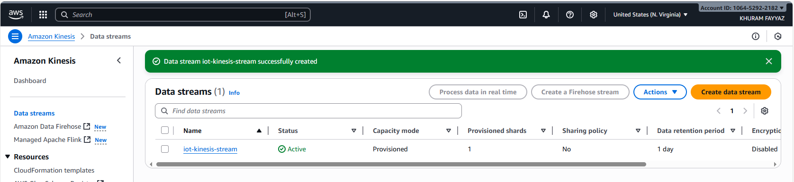
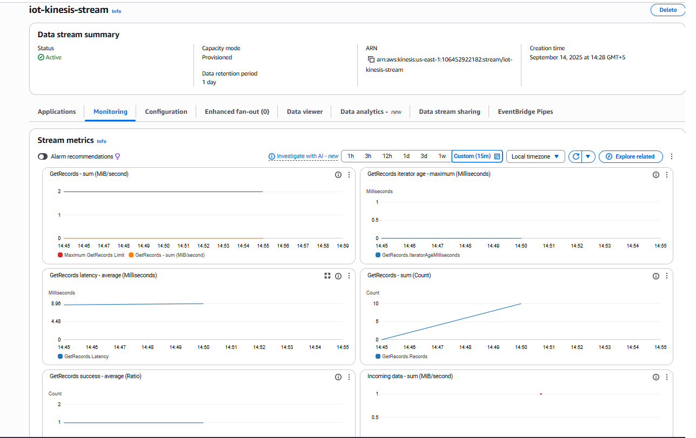

# IoT Kinesis Data Streaming Pipeline

This project demonstrates a real-time **IoT data streaming pipeline** built using **AWS Kinesis**, where sensor data (e.g., temperature, humidity, device telemetry) is ingested, processed, and stored for downstream analytics.

---

## 🚀 Architecture

1. **IoT Device / Sensor (Raspberry Pi, ESP8266, etc.)**
   - Sends real-time sensor data (JSON format).

2. **AWS Kinesis Data Stream**
   - Ingests high-throughput, real-time data.

3. **AWS Lambda**
   - Processes streaming data from Kinesis.
   - Generates **JSON format** output to store in S3.

4. **Amazon S3**
   - Stores processed JSON data.

5. **AWS Athena / Additional Lambda**
   - Query or transform JSON data into formats suitable for analytics (e.g., Parquet or CSV) for live dashboards.

6. **Analytics (Power BI / QuickSight)**
   - Runs queries and dashboards on transformed IoT data.
     
   

---

## 🛠️ Technologies Used
- **AWS Kinesis Data Streams**
- **AWS Lambda**
- **Amazon S3**
- **AWS Athena** (or secondary Lambda for transformation)
- **Raspberry Pi / ESP8266 (IoT devices)**
- **Python (data producer & Lambda functions)**
- **Power BI / QuickSight (analytics)**

---

## 📂 Project Structure
iot-kinesis-streaming-pipeline/
│── producer/ # IoT device scripts (Python)
│── lambda/ # AWS Lambda function code (JSON generator & transformer)
│── data/ # Sample output data
│── README.md # Project documentation

#1. Configure IoT Device
Run the data producer script to push sensor data into Kinesis.

2. Deploy Lambda
Add environment variables for S3 bucket and stream name.

Lambda will process Kinesis data and write JSON files to S3

3. Transform Data for Analytics
Use AWS Athena or an additional Lambda function to convert JSON into analytics-friendly formats (CSV/Parquet) for live dashboards.

4. Run Analytics
Connect Power BI to the transformed data.

Visualize and query IoT data in near real-time.

**📊 Sample Use Cases**
Real-time temperature monitoring.

IoT device telemetry dashboards.

Predictive maintenance using sensor data.

Data lake ingestion for analytics.

**🔮 Future Enhancements**
Integrate AWS Kinesis Data Analytics for SQL-based streaming queries.

Implement QuickSight dashboards for real-time visualization.

Implement CI/CD pipeline for automated deployments.

**🤝 Contributing**
Pull requests are welcome! For significant changes, please open an issue first to discuss what you’d like to change.

**📜 License**
This project is licensed under the MIT License — see the LICENSE file for details.
